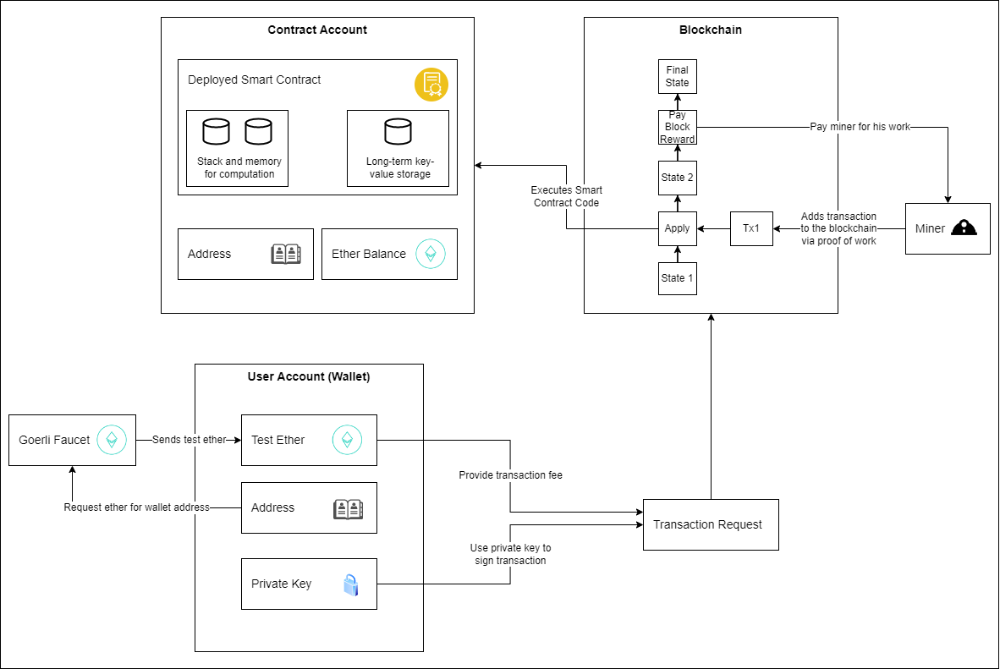

# Hello World Smart Contract for Ethereum Blockchain <!-- omit in toc -->

1. [Summary](#summary)
2. [Pre-requisites](#pre-requisites)
3. [Getting Started](#getting-started)
4. [Important Commands](#important-commands)
5. [Important Links](#important-links)

# Summary

Very small example project to work with Ethereum blockchain and develop a first smart contract. Project is based on a [tutorial](https://docs.alchemy.com/alchemy/tutorials/hello-world-smart-contract) and has been adjusted.

The smart contract can be used to greet someone. You can update the person you want to greet via public function.

You can use the Goerli test network for development and testing purposes without the need to use "real" ether.

A **very simplified** diagram of the structure and process is depicted below (based on Ethereum 1):

# Pre-requisites

You will need some tools in order to get started. You will find detailed installation instructions [here](https://docs.alchemy.com/alchemy/tutorials/hello-world-smart-contract).
- alchemy account
- alchemy app
- Ethereum wallet (e.g. MetaMask)
- VS Code (with solidity extension) installed
- npm installed

# Getting Started

1. Once you have setup an app in alchemy and gathered some ether in your wallet - both for the Goerli test network as described in the tutorial, you can start working with the smart contract
2. Run `npm install`
3. Configure missing properties in .env (you can leave the contract address empty for now)
4. Compile using command `npx hardhat compile`
5. Deploy using `npx hardhat run scripts/deploy.js --network goerli`
6. Now you can copy the contract address and paste it into your .env file
7. Test by receiving the current message using `npx hardhat run scripts/get-message.js --network goerli`
8. Greet somebody else by running `npx hardhat run scripts/greet.js --network goerli`

# Important Commands

| Command                                                   | Description                                                        |
| --------------------------------------------------------- | ------------------------------------------------------------------ |
| `npm install`                                             | Installs all dependencies                                          |
| `npx hardhat compile`                                     | Compiles the smart contract - required if you change the .sol file |
| `npx hardhat run scripts/deploy.js --network goerli`      | Deploys the smart contract to the test network                     |
| `npx hardhat run scripts/get-message.js --network goerli` | Gets the currently active message                                  |
| `npx hardhat run scripts/greet.js --network goerli`       | Updates the message to a new recipient                             |

# Important Links

| Link                                                    | Description                                                                     |
| ------------------------------------------------------- | ------------------------------------------------------------------------------- |
| [Alchemy](https://dashboard.alchemyapi.io/)             | Development platform with which you can start without maintaining your own node |
| [MetaMask](https://metamask.io/)                        | Wallet that can be used for dev purposes                                        |
| [Goerli Testnet Explorer](https://goerli.etherscan.io/) | Here you can search the test network for deployed smart contracts               |
| [Goerli Faucet](https://goerlifaucet.com/)              | Lets you request test ether to use in the test network                          |
| [Ethereum Website](https://ethereum.org/)               | General information about Ethereum                                              |
